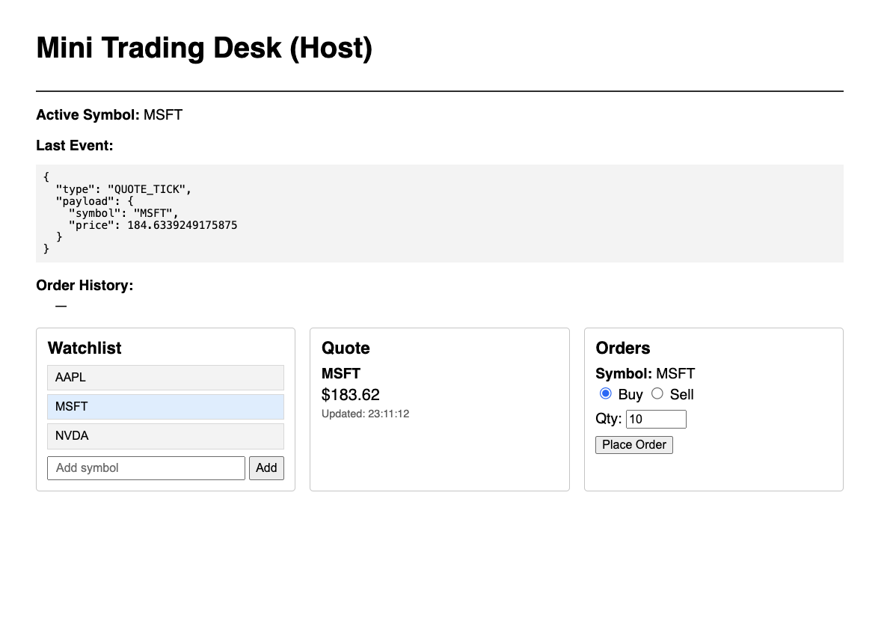

# Mini Trading Desk — Webpack 5 Module Federation Demo

A small Micro-Frontend (MFE) demo with a host shell and three remotes: **watchlist**, **quote**, and **orders**.

## Screenshot



## Full folder/file list

```
MFE-Demo/
├── README.md
├── container-host/
│   ├── package.json
│   ├── webpack.config.js
│   ├── public/
│   │   └── index.html
│   └── src/
│       ├── index.jsx          # entry: imports bootstrap
│       ├── bootstrap.jsx      # mounts React app
│       ├── App.jsx            # host shell + lazy remotes
│       ├── ErrorBoundary.jsx
│       └── eventBus.js
├── remote-watchlist/
│   ├── package.json
│   ├── webpack.config.js
│   ├── public/
│   │   └── index.html
│   └── src/
│       ├── index.jsx
│       ├── bootstrap.jsx
│       └── App.jsx
├── remote-quote/
│   ├── package.json
│   ├── webpack.config.js
│   ├── public/
│   │   └── index.html
│   └── src/
│       ├── index.jsx
│       ├── bootstrap.jsx
│       └── App.jsx
└── remote-orders/
    ├── package.json
    ├── webpack.config.js
    ├── public/
    │   └── index.html
    └── src/
        ├── index.jsx
        ├── bootstrap.jsx
        └── App.jsx
```

## Install and run

**1. Install dependencies in all four apps**

```bash
cd container-host && npm install && cd ../..
cd remote-watchlist && npm install && cd ../..
cd remote-quote && npm install && cd ../..
cd remote-orders && npm install && cd ../..
```

Or from repo root (one-liner):

```bash
cd mfe-mini-trading-desk && for d in container-host remote-watchlist remote-quote remote-orders; do (cd $d && npm install); done
```

**2. Start all four dev servers (in separate terminals)**

```bash
# Terminal 1 — remotes first (host will load them)
cd remote-watchlist && npm start

# Terminal 2
cd remote-quote && npm start

# Terminal 3
cd remote-orders && npm start

# Terminal 4 — host last
cd container-host && npm start
```

**Ports**

| App   | Port |
|-------|------|
| host  | 3000 |
| watchlist | 3001 |
| quote | 3002 |
| orders | 3003 |

**3. Open the host**

- http://localhost:3000

The host loads the three remotes from 3001, 3002, 3003. Ensure all four servers are running.

## Why the bootstrap pattern?

- **Entry** is `src/index.jsx`, which only does `import("./bootstrap")` (dynamic import).
- **Bootstrap** is `src/bootstrap.jsx`, which imports React/ReactDOM and your root component and calls `createRoot` / `render`.

With Module Federation, shared modules (e.g. `react`, `react-dom`) are loaded asynchronously. If the entry file imports React at the top level and then immediately renders, the shared runtime might not be ready yet, which can cause duplicate React instances or “Invalid hook call” style errors.

By using a dynamic `import("./bootstrap")`, the bootstrap (and thus React and the app) run **after** the shared scope is initialized. That way a single React instance is used across host and remotes (singleton), and the app renders only when the federation runtime is ready.

So: **bootstrap pattern = async entry so shared deps are ready before any React code runs.**
